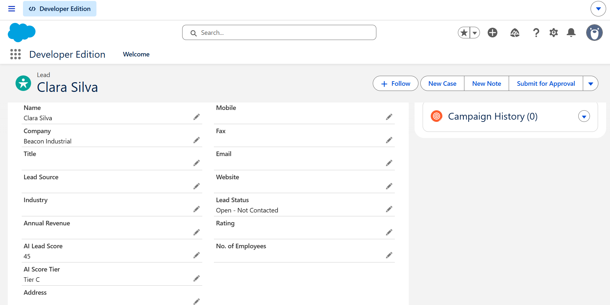
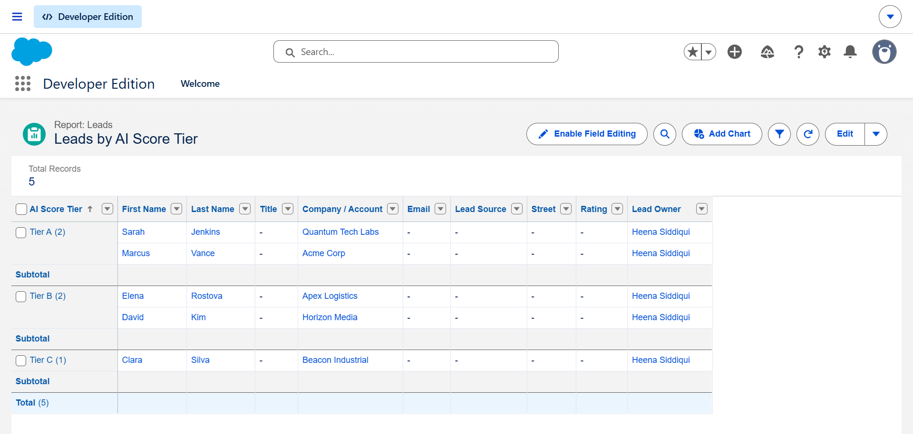
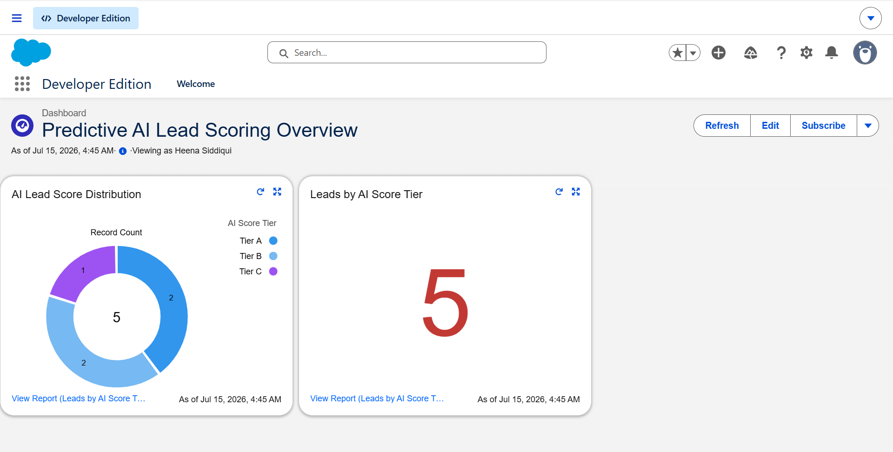
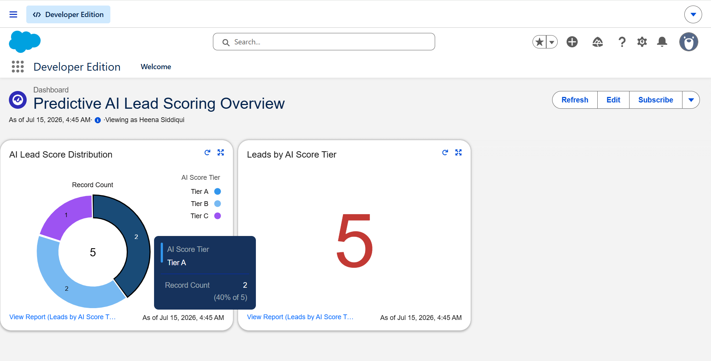

# Salesforce Predictive AI Lead Scoring System

An end-to-end cloud CRM solution designed to help sales teams prioritize incoming leads using predictive AI metrics. This project demonstrates database schema customization, custom report generation, and interactive dashboard design within the Salesforce Lightning platform.

---

## Project Architecture & Visual Walkthrough

### Step 1: Lead Database Customization
We expanded the standard Salesforce Lead object schema by adding custom fields to capture predictive scoring data.
* **Fields Configured:** `AI Lead Score` (Number) and `AI Score Tier` (Picklist: Tier A, Tier B, Tier C).

---

### Step 2: Lead Intelligence Pipeline
Once the fields were configured, we used the Lead Intelligence View to monitor incoming leads and ensure correct data entry and tracking.

---

### Step 3: Reporting & Data Aggregation
To prepare the raw data for visual representation, we built a custom report grouping leads dynamically by their designated AI Score Tiers. This acts as the logic engine behind our dashboard.

---

### Step 4: Executive Interactive Dashboard
The final presentation layer displays a live KPI summary alongside an interactive Donut Chart. This side-by-side layout allows sales managers to easily hover over segments for real-time percentage breakdowns or drill down directly into the underlying records.

---

## Technical Skills Demonstrated
* **Salesforce Administration:** Object customization, Page Layouts, Schema Design, and User Interface optimization.
* **Data Analytics:** Custom Report Types, Row Groupings, Summary Formulas, and Charting.
* **UI/UX Design:** High-contrast executive dashboard structures optimized for rapid business decision-making.
